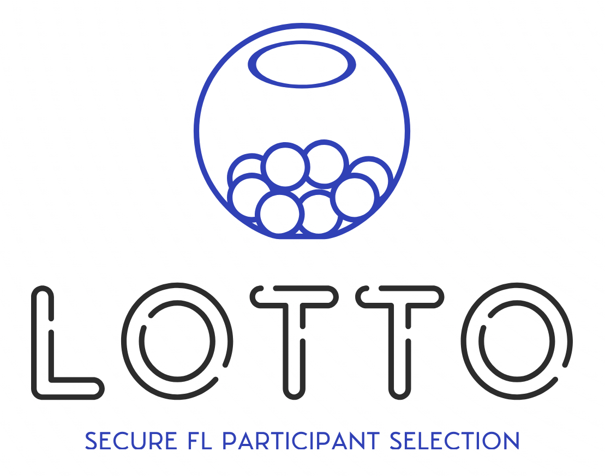

    

    
    
    

<h1 align="center">Lotto: Secure Participant Selection against Adversarial Servers in Federated Learning</h1>

Posted by [Zhifeng Jiang](http://home.cse.ust.hk/~zjiangaj/), *HKUST* on Tuesday, October 31, 2023.
Other authors include Peng Ye, *HKUST*; Shiqi He, *UMich*; Wei Wang, *HKUST*;
Ruichuan Chen, *Nokia Bell Labs*; and Bo Li, *HKUST*.

## Enforcing Honest Majority in Centralized Settings

Edge devices, such as smartphones and laptops, are becoming increasingly
powerful and can now collaboratively build high-quality machine learning
(ML) models using device-collected data.
To  protect data privacy, large companies like Google and Apple have
adopted [**federated learning** (FL)](http://proceedings.mlr.press/v54/mcmahan17a/mcmahan17a.pdf) for
tasks in computer vision (CV) and natural language processing (NLP) across
client devices.
In the [standard workflow](https://proceedings.mlsys.org/paper_files/paper/2019/file/7b770da633baf74895be22a8807f1a8f-Paper.pdf)
of FL, a server dynamically samples a small subset of clients from a large
population in each training round. The sampled clients, aka **participants**,
compute individual local updates using their own data and
upload only the updates to the server for global aggregation, without
revealing the training data.

However, simply keeping client’s data undisclosed is not sufficient to
preserve data privacy. Recent studies have demonstrated that sensitive data
can be leaked through individual updates during FL training, and it
is also possible to infer a client's data from trained models by exploiting their ability to memorize
information. To minimize data leakage, current FL systems employ
**[secure aggregation](https://dl.acm.org/doi/pdf/10.1145/3133956.3133982)** techniques to ensure that
adversaries only learn the aggregate updates, not individual ones.
Additionally, these systems may use
**[distributed differential privacy](https://blog.research.google/2023/03/distributed-differential-privacy-for.html)** 
(DP) to limit the extent of data leakage from the aggregate update. Since the server may not always be trusted, these
privacy-preserving approaches commonly assume that the **majority** of the
participants act honestly and can jointly detect and prevent server misbehavior.

Nonetheless, this assumption **may not hold in practice**, as an adversarial
server can strategically select compromised clients that collude with it.
Note that this is a feasible attack. While the entire client population is
large, the target number of participants in each round is often limited to
[**a few hundred**](https://proceedings.mlsys.org/paper_files/paper/2019/file/7b770da633baf74895be22a8807f1a8f-Paper.pdf) for efficiency purposes. Consequently,
even if the majority of the population is honest (e.g., 99% out of 100,000
clients), the server can still select a sufficient number of adversaries to
create a **dishonest majority** among participants.

The presence of a large number of compromised participants
undermines the aforementioned privacy-preserving approaches, resulting in
**significant vulnerabilities**. As we observed, the
privacy guarantees provided by distributed DP degrade rapidly as the
dishonest cohort expands. Furthermore, secure aggregation can only tolerate a
certain proportion of clients colluding with the server; exceeding this
limit would allow the adversary to reconstruct a client's update.
It is hence crucial to **minimize the proportion of
participants that the server can manipulate** during the client selection
process.

Despite its importance, this problem remains **largely unaddressed** in the literature.
The main challenge lies in the use of a central server in the [cross-device
FL scenarios](https://arxiv.org/pdf/1912.04977.pdf). In the absence of efficient
peer-to-peer communication across a vast array of heterogeneous devices,
the server serves as a **central hub**
facilitating message exchanges between clients. Since the server is untrusted,
an honest client may not have a ground truth view of other clients, such as their
availability, utility, and integrity. Consequently, it is **difficult for a client to
audit** whether the server has correctly executed the prescribed participant
selection algorithm, as doing so requires ground truth knowledge of and/or
inputs from other clients.

## Approaching Secure Participant Selection with Verifiable Randomness

In this project, we develop **Lotto**, a novel system that enables secure
participant selection in FL for the first time. Our key insight is that while
an honest majority may not exist among participants produced by the server,
it should hold among the entire client population, given the **[prohibitive cost](https://ieeexplore.ieee.org/iel7/9833550/9833558/09833647.pdf?casa_token=dHE_kaMFEzAAAAAA:C0xM8MQ09sB9T2NAcPAo6QXe0-1DjxcCABEklZdsMLUbL-JbcqSiVxh3QPm-MRtBlnZc8OU)**
of creating and operating a large number of adversarial
clients.
Therefore, by incorporating **verifiable randomness** to the selection process,
we can prevent the adversarial server from selecting an arbitrary number of
dishonest participants.

Specifically, to achieve secure **random selection**, Lotto allows each client
in the population to
determine its participation in a training round by computing **[verifiable random functions](https://eprint.iacr.org/2004/310.pdf)**
(VRFs) using its secret key and public
inputs. Once a client decides to participate, Lotto collects the referred
randomness, along with the associated VRF proof, for other participants to
verify the generation of the randomness. This approach ensures that each
client's participation is provably independent of, fair to, and unpredictable
for other clients. Yet, an adversarial server may still exploit this process
to grow the dishonest cohort, for example, by sending incorrect and/or a
selected subset of messages.
Lotto further mitigates such misconduct by enabling honest clients to
**verify critical messages**.
Lotto provides a **provable guarantee** that the compromised fraction of
selected participants remains minimum, thereby maintaining the security guarantees
offered by secure aggregation and distributed DP.

Lotto is also capable of securing more advanced
algorithms, referred to as **informed selection**, which are widely used in FL
to judiciously select the best-performing participants for optimal training
efficiency, such as [Oort](https://www.usenix.org/system/files/osdi21-lai.pdf).
Given that these algorithms rely on
client-specific measurements (e.g., processing speed and data quality) that
are difficult to verify, Lotto does not attempt to precisely follow their
selection logic. Instead, it **approximates them** by reducing an informed
selection problem to a random one. To do so, it first allows the server
to **refine the client pool** by excluding a small fraction of low-quality
clients based on the specified measurements. Lotto then **performs secure
random selection** from the refined pool. Although an adversarial server may still
attempt to manipulate this process by excluding honest clients, the security
of our random selection ensures that any advantage it gains is **provably
small**.

We have implemented Lotto as a library and evaluated its
performance with various FL tasks in a large EC2 cluster configured to
emulate a cross-device scenario. Compared to insecure
selection algorithms, Lotto **slightly increases the duration** of each
training round by less than 10% while achieving **comparable or even better
time-to-accuracy** performance.

## Support

Thank you for interest in our project.
Should you have any further inquiry, feel free to submit a Github issue, or contact Zhifeng Jiang via zjiangaj@cse.ust.hk.
